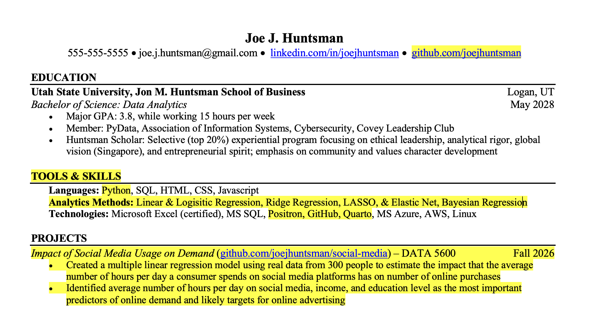
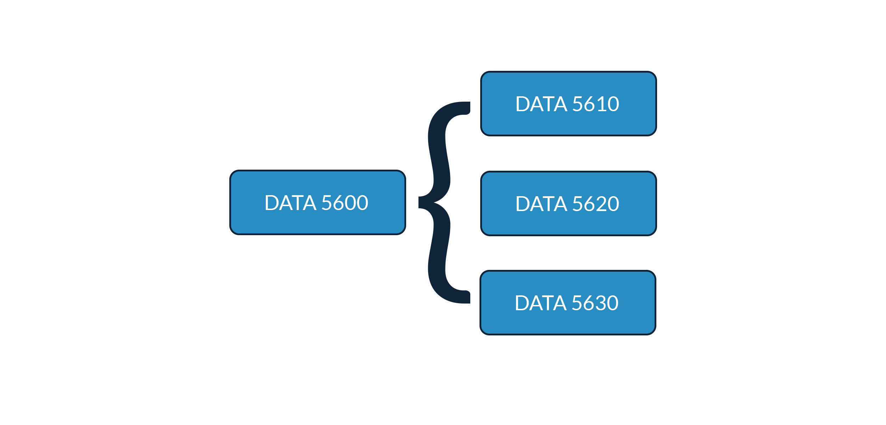

# DATA 5600 Introduction to Regression and Machine Learning for Analytics

This course introduces machine learning for business analytics,
including linear, logistic, and penalized regression. Emphasis is on
building interpretable models, evaluating assumptions, and communicating
results, with real-world projects connecting modeling techniques to
business decision-making. Prerequisites: DATA 3100 and DATA 3300

By the end of this course, students will be able to:

1.  Build, evaluate, and interpret models to inform decision-making for
    non-technical stakeholders.
2.  Diagnose and address violations of model assumptions to ensure
    appropriate model use.
3.  Communicate model results clearly in a business context.

## Learning Objectives

The [IDEA](https://www.ideaedu.org) essential learning objectives for
this course are:

- Gaining a basic understanding of the subject (e.g., factual knowledge,
  methods, principles, generalizations, theories).
- Learning to apply course material (to improve thinking, problem
  solving, and decisions).
- Developing specific skills, competencies, and points of view needed by
  professionals in the field most closely related to this course.
- Learning appropriate methods for collecting, analyzing, and
  interpreting numerical information.

Since applying conceptual understanding and skills to data analytics
problems in practice is a group effort, effective group work will be a
critical part of student assessment in this course.

## Study and Success

Successful students in this course will demonstrate conceptual
understanding and skill mastery by applying the modeling workflow within
their chosen business context as part of a group. Each student is an
essential member of a group and community of learners.

Students can focus on learning by using the following study tips:

1.  Prepare for class by previewing material and identifying questions.
2.  Engage during class by asking questions, taking notes, and actively
    coding.
3.  Apply what you learn in class by completing exercises and working on
    projects.
4.  Evaluate what you’re learning by reviewing and reflecting on course
    materials and exercise solutions.
5.  Reinforce what you’re learning by utilizing office hours and working
    with group members.

After completing the course, student resumes should reflect the tools,
skills, and methods they have learned and showcase the projects they
have completed. For example:

DATA 5600 provides the foundation as a prerequisite for subsequent
courses in the modeling sequence. This includes DATA 5610 Advanced
Machine Learning for Analytics, DATA 5620 Advanced Regression for Causal
Inference, and DATA 5630 Deep Forecasting.

## Data Stack

Each student will need to bring a laptop, either their own or one rented
from Utah State, and use the following [data
stack](https://github.com/marcdotson/data-stack).

Every modern data stack includes AI tools. All Utah State students have
[access to a specific set](https://www.usu.edu/ai/tools). While AI can
help learning and productivity (e.g., drafting and debugging code,
explaining concepts in new ways, practicing for interviews), it can be
harmful when we use it to replace rather than supplement thinking and
decision-making—especially when we don’t know enough about a topic to
evaluate what the AI generates. If students use AI tools, they should be
thoughtful and transparent, including reviewing what the AI generates
and citing the AI tool they use.

### Positron

A code editor or integrated development environment (IDE), outside of an
open source programming language, is a data analyst’s most important
tool. [Positron](https://positron.posit.co) is a next-generation data
science IDE. Built on VS Code’s [open source
core](https://github.com/microsoft/vscode), Positron combines the
multilingual extensibility of [VS Code](https://code.visualstudio.com/)
with essential data tools common to language-specific IDEs. See the
[data stack
training](https://github.com/marcdotson/data-stack?tab=readme-ov-file#sec-positron)
for a summary of Positron’s data-friendly features.

### Python

[Python](https://en.wikipedia.org/wiki/Python_(programming_language)) is
a general purpose, open source programming language developed by
computer scientists. It is the most commonly used programming language
for data wrangling, visualizations, and modeling. Students will be
evaluated on their ability to use and adapt the code provided as part of
the course. See the [data stack
training](https://github.com/marcdotson/data-stack?tab=readme-ov-file#sec-python)
for how to install and manage Python versions and project environments.

### Quarto

[Quarto](https://quarto.org) is an open source publishing system that
combines text, code, and output. Quarto documents are similar to Jupyter
notebooks, except the content can be rendered into a variety of formats,
including PDFs, Word documents, PowerPoint presentations, Revealjs slide
decks, interactive dashboards, websites, etc. Students will be required
to submit code and output in Quarto and PDF formats. See the [data stack
training](https://github.com/marcdotson/data-stack?tab=readme-ov-file#sec-quarto)
for more details on Quarto.

### GitHub

[GitHub](https://github.com/about) is an online hosting service for
project repositories managed using Git, a powerful [version control
system](https://peerj.com/preprints/3159v2/) and the industry standard
for software development and data projects. Git and GitHub facilitates
collaboration on a single code base and enables students to organize an
online portfolio of work. See the [data stack
training](https://github.com/marcdotson/data-stack?tab=readme-ov-file#sec-github)
for the basics of using Git and GitHub and a [project
template](https://github.com/marcdotson/project-template) for the course
projects.

## Assessment

Assignments are designed to be aligned with what students will be
expected to do in practice. No credit will be given for late work unless
an arrangement is made **prior to the relevant deadline**. Students are
encouraged to review their graded work and ask questions to avoid
repeated mistakes.

Letter grades will follow the standard rubric and will be determined as
follows.

|     |         |     |        |     |        |
|:----|:--------|:----|:-------|:----|:-------|
| A   | 93-100% | B-  | 80-82% | D+  | 67-69% |
| A-  | 90-92%  | C+  | 77-79% | D   | 63-66% |
| B+  | 87-89%  | C   | 73-76% | D-  | 60-62% |
| B   | 83-86%  | C-  | 70-72% | E   | 0-59%  |

### Exercises (20%)

Each lecture ends with an exercise designed to help students practice
what was covered in the lecture and prepare to apply it to their
projects.

- Each exercise is due before the following lecture. While students are
  encouraged to work together as a group, each student is required to
  submit their own work. Students won’t get credit for an exercise if
  they don’t submit their exercise on time.
- Before each lecture, a student will be called on at random to share
  their exercise solution, explaining what they did and why. This is an
  opportunity for students to practice discussing code and concepts in
  preparation for interviews and project presentations. Students won’t
  get credit for an exercise if they don’t share their exercise solution
  when called on at random.
- For each exercise, every student will be randomly assigned to review
  one other student’s exercise solution, including rating that student’s
  work from 1-3 (i.e., “Needs Improvement,” “Good,” “Excellent”), by the
  end of the week that the exercise was due. Code evaluation is a
  critical skill for students to develop. Students won’t get credit for
  an exercise if they don’t complete their randomly assigned peer review
  on time.

### Projects (50%)

Projects are the focus of learning by doing in the course, serving as
the means for students to apply their conceptual understanding and skill
mastery both as a group and within their business domain of interest.
Students will complete two group projects, one focused on regression and
another focused on classification. The groups will both present and
submit a report.

At the end of each week, each group will submit a recording to share
their progress on that week’s project milestones, including what they’ve
pushed to GitHub. The week before the presentations, groups will submit
a draft of their slides to get feedback and have time for revision. The
other students in the class, as well as the group members themselves,
will help evaluate each of the presentations.

### Interviews (30%)

Interviews are an opportunity for students to demonstrate their
understanding of the course material as applied to their project work
and prepare for future real-world job interviews. Designed to complement
exercise practice and project work, interviews will be conducted as a
group and will include questions randomly assigned to group members
about course concepts as applied to project work, including explaining
project code. Questions asked during each lecture are provided to
students to help them prepare for interviews. AI may not be used during
interviews.

Interviews with the instructor will occur at the beginning, middle, and
end of the semester during office hours or by appointment.

## Schedule

Please note that the instructor reserves the right to change the
following schedule at any time and will provide students sufficient
notice as it relates to assignment deadlines.

### Week 01 (August 31-September 5)

- Regression and Machine Learning
- Modeling Workflow

### Week 02 (September 6-12)

- Decisions and Data

### Week 03 (September 13-19)

- Probability and Statistics
- Linear Models

### Week 04 (September 20-26)

- Validity, Representativeness, and Linearity
- Independence, Constant Variance, Normality, and Identifiability

### Week 05 (September 27-October 3)

- Ordinary Least Squares
- Frequentist and Bayesian Inference

### Week 06 (October 4-10)

- Model Evaluation and Prediction
- Communicating Results

### Week 07 (October 11-17)

- Presentations

### Week 08 (October 18-24)

- Asymmetric Loss
- Generalized Linear Models

### Week 09 (October 25-31)

- Logistic Regression
- Maximum Likelihood Estimation

<!-- ### Week 10
&#10;- Spring Break -->

### Week 10 (November 1-7)

- Hyperparameters
- Confusion and Cross-Validation

### Week 11 (November 8-14)

- Penalized Regression
- Ridge Regression, LASSO, and Elastic Net

### Week 12 (November 15-21)

- Dimensionality Reduction
- Principal Component Regression

### Week 13 (November 22-28)

- Thanksgiving Break

### Week 14 (November 29-December 5)

- Interactions
- Multilevel Models

### Week 15 (December 6-December 11)

- Presentations
