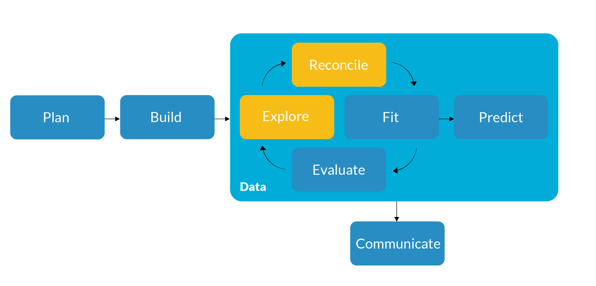
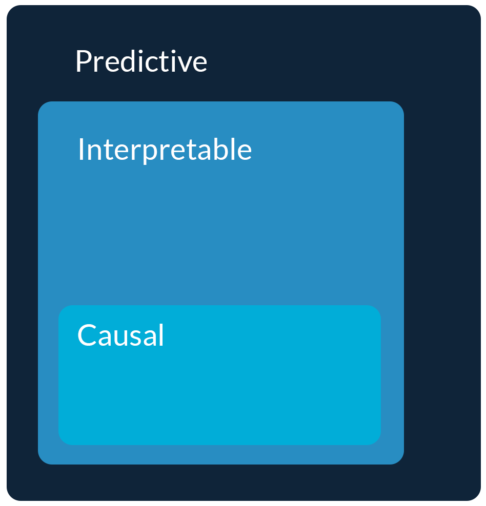
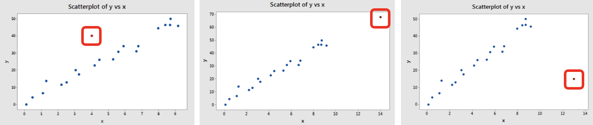
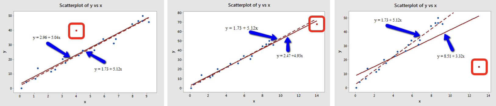

## {background-color="#288DC2"}

### Get Started {.permanent-marker-font}

#### Last Time

- Formally introduced linear regression

#### Preview

- Start working with real data
- Review exploratory data analysis
- Begin reconciling the data and the model

## {background-color="#D1CBBD"}

::: {.columns .v-center}
{fig-align="center"}
:::

## How did we get here?

::: {.incremental}
- We want to inform a decision
- We are uncertain about information critical to making that decision
- We formalized our objective into a loss (or utility) function
- We built a probability model, which includes unknown parameters that represent the information we are uncertain about
- We are using a line to model the mean of a normal distribution (i.e., regression) because its the simplest model possible
:::

## Assumptions all the way down

We need to use **diagnostics** to see if the model assumptions are met and **remedy** any issues so that our interpretation (i.e., statistical inference) is valid

:::: {.columns}

::: {.column width="50%"}
::: {.fragment}
{fig-align="center"}
:::
:::

::: {.column width="50%"}
::: {.incremental}
- Flexible, black-box models aren't interpretable
- Inferences from interpretable models require assumptions
- Causal effects require **additional assumptions** to be met
:::
:::

::::

## Linear regression assumptions

1. **Validity**: Data is relevant to the objective and no predictors are missing
2. **Representativeness**: Data is representative of the data generating process or population
3. **Linearity**: The mapping function from the predictors to the outcome is an additive, linear function of the parameters
4. **Independence**: Observations are independent of each other
5. **Constant Variance**: Homoscedasticity or constant variance of errors
6. **Normality**: Variation or error is normally distributed
7. **Identifiability**: Data allows for parameters to be estimated, including no strong multicollinearity

# Exploratory Data Analysis

## Coding for data analysis

Programming for data analytics is different from programming for software development

::: {.incremental}
- Code is **custom** and **interactive**
- Our focus should be on **human-readable code**
- Preference for **consistent grammar** and **method chaining**
:::

::: {.fragment}
All three data analysis tasks -- **data wrangling**, **visualization**, and **modeling** -- are **interconnected** and **iterative**
:::

## Understand the data and its limitations

Remember that it is your job as a data analyst to understand the data so you can communicate about the data and address its limitations

::: {.incremental}
- Visualize data and relationships
- Compute numeric summaries
- Check for missing data, outliers, and errors
- Consider proxy variables
- Ask questions
:::

::: {.fragment}
Conducting EDA **with the model assumptions in mind** will help you identify potential issues and needed remedies early
:::

## Parquet, *pour quoi*?

Apache Parquet is an open source, **column-oriented data file format** designed for efficient data storage and retrieval (produced as part of the Apache Arrow project)

```{python}
#| eval: true
#| echo: false

import numpy as np
import polars as pl
from plotnine import *
from pyprojroot.here import here

# Import data
pb_data = (pl.read_parquet(here('data/original_df.parquet'))
  .select('customer_id', 'units', 'sales', 'brand', 'promo', 'loyal', 'texture', 'size', 'price')
  .cast({'size': pl.String})
  .filter(pl.col('units') > 0)
)
```

```{python}
#| code-line-numbers: "|4,7"

import numpy as np
import polars as pl
from plotnine import *
from pyprojroot.here import here

# Import data
pb_data = (pl.read_parquet(here('data/soft_launch.parquet'))
  .filter(pl.col('units') > 0)
)
```

::: {.fragment}
When including a file path in your code to read or write other files, use a library to create a **relative file path**
:::

## {.scrollable}

Let's look at some already cleaned data to review the **data dictionary** and use Positron's **data explorer** (including previewing without loading files)

```{python}
#| eval: true

pb_data
```

## Variable types and relationships

:::: {.columns}

::: {.fragment .column width="33%"}
**Discrete**

"Individually separate and distinct" (i.e., **categorical** or qualitative)

::: {.incremental}
- Counts
- Column/bar plots
- Facets
:::
:::

::: {.fragment .column width="33%"}
**Continuous**

"Forming an unbroken whole; without interruption" (i.e., **numeric** or quantitative)

::: {.incremental}
- Means
- Histograms
- Correlations
- Scatterplots
:::
:::

::: {.fragment .column width="33%"}
**Discrete and Continuous**

Comparing continuous values by discrete levels

::: {.incremental}
- Grouped summaries
- Boxplots
- Density plots
- Facets
:::
:::

::::

## Counts and column plots

Libraries with consistent, human-readable syntax lend themselves to method chaining, including the [grammar of graphics](https://link.springer.com/book/10.1007/0-387-28695-0) where each plot is composed of **data**, a **mapping** from data to visual elements, the **specific graphic**

```{python}
#| eval: true
#| output-location: column

texture_count = (pb_data
  .group_by(pl.col('texture'))
  .agg(n = pl.len())
)

(ggplot(
    texture_count, 
    aes(x = 'texture', y = 'n')
  )
  + geom_col()
)
```

## Counts and column plots

```{python}
#| eval: true
#| output-location: column

(ggplot(pb_data, aes(x = 'texture'))
  + geom_bar()
)
```

::: {.fragment}
While not an issue with an assumption, how will our model handle **discrete** predictors? Can we include all of the levels of a given discrete predictor?
:::

## Counts and column plots

```{python}
#| eval: true
#| output-location: column

texture_count = (pb_data
  .group_by(pl.col(['texture', 'size']))
  .agg(n = pl.len())
)

(ggplot(
    texture_count, 
    aes(x = 'texture', y = 'n', fill = 'size')
  )
  + geom_col(position = 'dodge')
)
```

## Counts, column plots, and facets

```{python}
#| eval: true
#| output-location: column

texture_count = (pb_data
  .group_by(
    pl.col(['texture', 'size', 'brand'])
  )
  .agg(n = pl.len())
  .with_columns(
    (pl.col('n') / pl.col('n')
      .sum().over(['texture', 'size'])
    ).alias('prop')
  ).sort('brand')
)

(ggplot(
  texture_count, 
  aes(
    x = 'texture', 
    y = 'prop', 
    fill = 'brand'
  ))
  + geom_col()
  + facet_wrap('size')
)
```

## Means and histograms

Why is **right-skewed continuous data** common? Why might this be a problem with our assumptions?

```{python}
#| eval: true
#| output-location: column

pb_data['units'].drop_nans().mean()
```

```{python}
#| eval: true
#| output-location: column

(ggplot(pb_data, aes(x = 'units'))
  + geom_histogram(bins = 10)
)
```

## Log transformations

In the spirit of conducting EDA **with the model assumptions in mind**, it is common to transform either our $X$ predictor(s), $y$ outcome, or *both* to help satisfy model assumptions

::: {.incremental}
- If we have **right-skewed continuous data**, this is most commonly addressed by using a log transformation
- Any transformation, including a log transformation, is simply putting the data on a different **scale**
- When performing a log transformation, make sure to include an **offset** to avoid taking the log of zero
:::

::: {.fragment}
```{python}
#| eval: true

pb_data = (pb_data
  .with_columns(
    log_units = (pl.col('units') + 1).log()
  )
)
```

:::

## *Log transformed* means and histograms

```{python}
#| eval: true
#| output-location: column

pb_data['log_units'].drop_nans().mean()
```

```{python}
#| eval: true
#| output-location: column

(ggplot(pb_data, aes(x = 'log_units'))
  + geom_histogram(bins = 10)
)
```

## Correlations

```{python}
#| eval: true
#| output-location: column

(pb_data
  .select(['price', 'units'])
  .drop_nans()
  .corr()
)
```

## Scatterplots

```{python}
#| eval: true
#| output-location: column

(ggplot(
    pb_data, 
    aes(x = 'price', y = 'units')
  )
  + geom_jitter(alpha = 0.25)
  + geom_smooth(method = 'lm', se = False)
)
```

## Correlation matrices

```{python}
#| eval: true

(pb_data
  .select(['price', 'units', 'sales'])
  .drop_nans()
  .corr()
)
```

## Scatterplots matrices

```{python}
#| eval: true
#| output-location: column

cont_df = (pb_data
  .with_row_index('id')
  .select(['id', 'price', 'units', 'sales'])
  .unpivot(
    on = ['price', 'units', 'sales'], 
    index = 'id', 
    variable_name = 'cont_vars', 
    value_name = 'cont_vals'
  )
)
corr_df = cont_df.join(cont_df, on = 'id')

(ggplot(
    corr_df, 
    aes(x = 'cont_vals', y = 'cont_vals_right')
  )
  + geom_point()
  + geom_smooth(method = 'lm', se = False)
  + facet_wrap(
    '~ cont_vars + cont_vars_right', 
    scales = 'free'
  )
  + labs(x = '', y = '')
)
```

## Grouped summaries

```{python}
#| eval: true

(pb_data
  .group_by(pl.col(['texture', 'size']))
  .agg(
    n = pl.len(), 
    avg_units = pl.col('units').drop_nans().mean(), 
    avg_sales = pl.col('sales').drop_nans().mean()
  )
  .sort(pl.col('avg_units'), descending = True)
)
```

## Boxplots

```{python}
#| eval: true
#| output-location: column

(ggplot(
    pb_data, 
    aes(x = 'brand', y = 'units')
  ) 
  + geom_boxplot()
)
```

## Density plots

```{python}
#| eval: true
#| output-location: column

(ggplot(
    pb_data, 
    aes(x = 'units', fill = 'brand')
  )
  + geom_density(alpha = 0.25)
)
```

## Density plots and facets

```{python}
#| eval: true
#| output-location: column

(ggplot(
    pb_data, 
    aes(x = 'units', fill = 'brand')
  )
  + geom_density(alpha = 0.25)
  + facet_grid('size ~ texture')
)
```

# Visualize a different variable or set of variables, modifying some of this example code. What do you discover? {background-color="#006242"}

# Validity

## Validity

Data is relevant to the objective and no predictors are missing

::: {.fragment}
Why should we care about **omitted variables**? What about including variables that don't matter?
:::

:::: {.columns}

::: {.fragment .column width="50%"}
**Diagnostics**

::: {.incremental}
- Is the data relevant to the objective?
- How well does the data match the ideal data?
- How do the simulated and real outcomes compare?
:::
:::

::: {.fragment .column width="50%"}
**Remedies**

::: {.incremental}
- Get different data
- Find additional data
- Justify proxy variables
:::
:::

::::

## Simulated vs. real outcomes

We've already used simulated data to test our code, but here we can compare it to the real data as a concrete way to think about validity

```{python}
#| eval: true

# Set randomization seed
rng = np.random.default_rng(42)

# Specify a function to simulate data
def sim_data(n, beta_0, beta_price, beta_discount, beta_online, beta_promo, sigma):
  price = rng.normal(4, 2, size=n)
  discount = rng.normal(2, 1, size=n)
  online = rng.binomial(1, 0.7, size=n)
  promo = rng.binomial(1, 0.2, size=n)
  error = rng.normal(0, sigma, size=n)
  sales = (
    beta_0 + beta_price * price + beta_discount * discount + 
    beta_online * online + beta_promo * promo + error
  )

  # Return the output as a DataFrame
  return pl.DataFrame({
    'sales': sales, 'price': price,
    'discount': discount, 'online': online, 'promo': promo
  })
```

## Simulated vs. real outcomes

We've already used simulated data to test our code, but here we can compare it to the real data as a concrete way to think about validity

```{python}
#| eval: true
#| output-location: column

# Call the sim_data function
sm_data = sim_data(
  n = 100, beta_0 = 20, beta_price = -2, 
  beta_discount = 3, beta_online = 5, 
  beta_promo = 3, sigma = 5
)

# Compare the simulated and real outcomes
(ggplot()
  + geom_density(
    sm_data, 
    aes(x = 'sales'), 
    color = 'red'
  )
  + geom_density(
    pb_data, 
    aes(x = 'sales')
  )
)
```

# Change a parameter value or remove a predictor. How does the comparison between simulated and real outcomes change? {background-color="#006242"}

# Representativeness

## Representativeness

Data is representative of the data generating process or population

::: {.fragment}
Why should we care about the data being representative? What's the difference between **underfitting** and **overfitting**?
:::

:::: {.columns}

::: {.fragment .column width="50%"}
**Diagnostics**

::: {.incremental}
- How was the data collected?
- Is it representative of the process or population we care about?
- Is data **missing at random**?
- Check for **influential points**
:::
:::

::: {.fragment .column width="50%"}
**Remedies**

::: {.incremental}
- Get different data
- **Drop or impute** missing data
- Investigate influential points and **consider** removing
:::
:::

::::

## Outliers vs. leverage points

**Outliers** and **leverage points** are both *potential* influential points, data that unduly influences the linear regression

::: {.incremental}
- An outlier is a point whose response does not follow the general trend of the rest of the data (i.e., extreme $y$ value)
- A leverage point is a point with a predictor value that is outside the norm (extreme $X$ value)
:::

::: {.fragment}
{fig-align="center"}
:::

## Outliers vs. leverage points {visibility="uncounted"}

**Outliers** and **leverage points** are both *potential* influential points, data that unduly influences the linear regression

- An outlier is a point whose response does not follow the general trend of the rest of the data (i.e., extreme $y$ value)
- A leverage point is a point with a predictor value that is outside the norm (extreme $X$ value)

{fig-align="center"}

## Check for influential points

To diagnose influential points, we can use visualizations or we can fit a model and use either **DFBETAS** or **DFFITS** to determine how "df" or "different" estimates or the overall model fit would be if a given observation were removed, respectively

```{python}
#| eval: true
#| echo: false

pb_train = (pb_data
  .drop_nans()
  .to_dummies(
    columns = ['brand', 'promo', 'texture', 'size'], drop_first = True
  )
  .with_columns(
    (pl.col('units') + 1).log().alias('log_units'),
    (pl.col('price') + 1).log().alias('log_price')
  )
  .drop(['units', 'sales', 'price', 'loyal'])
)
```

```{python}
#| eval: true
#| code-line-numbers: "|5-6|11-13"

import statsmodels.formula.api as smf

# Fit a model
fit_01 = smf.ols(
  'log_units ~ log_price + brand_Jif + brand_Skippy + brand_PeterPan + texture_Smooth + size_12', 
  data = pb_train
).fit()

# Save the dffits values
pb_train = (pb_train
  .with_columns(dffits = fit_01.get_influence().dffits[0])
  .with_columns(abs_dffits = pl.col('dffits').abs())
  .with_row_index('observation')
)
```

## DFFITS

How different would the fitted value $\hat{y}_i$ be if observation $i$ wasn't used?

- $|\text{DFFITS}_i| \gt 1$ for $n \leq 30$
- $|\text{DFFITS}_i| \gt 2\sqrt{p/n}$ for $n \gt 30$

where $p$ represents the number of $\beta$s in the model (including the intercept)

```{python}
#| eval: true

n, p = len(pb_train), len(fit_01.params)
dffits_cutoff = 1 if n <= 30 else 2 * np.sqrt(p / n)
```

## DFFITS

```{python}
#| eval: true
#| output-location: column

(ggplot(
    pb_train, 
    aes(x = 'observation', y = 'abs_dffits')
  )
  + geom_point(alpha=0.25)
  + geom_hline(
    yintercept = dffits_cutoff,
    color = 'red'
  )
  + labs(
    title = 'Representativeness: DFFITS',
    subtitle = 
      'Potentially influential above red line',
    x = 'Observation',
    y = 'Absolute Value of DFFITS'
  )
  + theme_minimal()
)
```

## Investigate influential points

Just because a point may be influential **doesn't mean it should be removed**, it means we should investigate it and decide if its representative

```{python}
#| eval: true

(pb_train
  .filter(pl.col('abs_dffits') > dffits_cutoff)
  .sort('dffits', descending = True)
)
```

## {background-color="#006242"}

### Exercise 06 {.lato-font}

1. Clean up the soft launch data
2. Create two interesting visualizations that help you understand the data and its limitations
3. Walk through the validity and representativeness assumptions and justify whether or not they are satisfied for your cleaned data
4. Submit both your Quarto document and your code, output, and explanations as a single PDF on Canvas

## {background-color="#288DC2"}

### Wrap Up {.permanent-marker-font}

#### Summary

- Started working with real data
- Reviewed exploratory data analysis
- Began reconciling the data and the model

#### Next Time

- Finish assumption diagnostics and remedies

