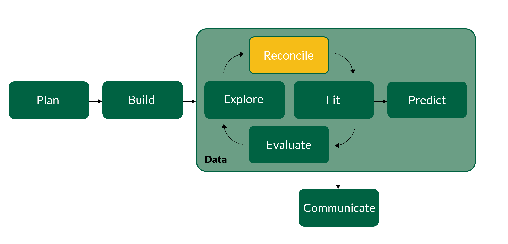
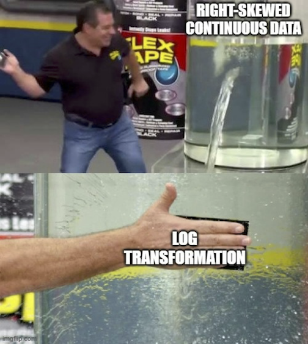
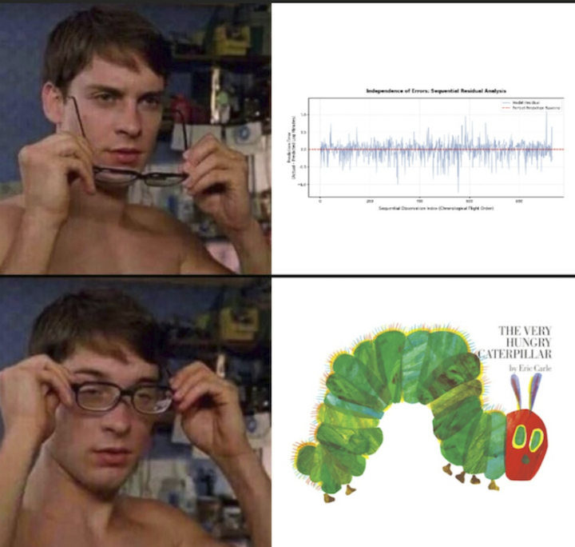

## {background-color="#288DC2"}

### Get Started {.permanent-marker-font}

#### Last Time

- Started working with real data
- Reviewed exploratory data analysis
- Began reconciling the data and the model

#### Preview

- Finish assumption diagnostics and remedies

## {background-color="#D1CBBD"}

::: {.columns .v-center}
{fig-align="center"}
:::

# Linearity

## 

:::: {.columns .v-center}

::: {.column width="60%"}
$$
y_i = \beta_0 + \beta_1 x_{1,i} + \cdots + \beta_p x_{p,i} + \epsilon_i \\
\text{where } \epsilon_i \sim \text{Normal}(0, \sigma^2)
$$

$$
y_i \sim \text{Normal}(\mu_i, \sigma^2) \\
\mu_i = \beta_0 + \beta_1 x_{1,i} + \cdots + \beta_p x_{p,i}
$$
:::

::: {.column width="40%"}
The mapping function from the predictors to the outcome is an additive, linear function **of the parameters**
:::

::::

## Functional form of the deterministic component

The mapping function from the predictors to the outcome is an additive, linear function of the parameters

::: {.fragment}
If the process or population isn't approximated by an additive, linear function, what happens to our inferences?
:::

:::: {.columns}

::: {.fragment .column width="50%"}
**Diagnostics**

::: {.incremental}
- Check for **non-linear relationships**
:::
:::

::: {.fragment .column width="50%"}
**Remedies**

::: {.incremental}
- Transform $X$
- Transform $y$
- Use a nonlinear model
:::
:::

::::

## Check for non-linear relationships

We can visualize the relationships between the **outcome and all of the predictors** or we can fit a model and see if there is any non-linear structure present by comparing **residuals vs. fitted values** or **partial regression plots**

```{python}
#| eval: true
#| echo: false

import numpy as np
import polars as pl
from plotnine import *
from pyprojroot.here import here
import statsmodels.formula.api as smf

# Set a default plot size
theme_update(figure_size=(5, 5))

# Import data
pb_data = (pl.read_parquet(here('data/original_df.parquet'))
  .select('customer_id', 'units', 'sales', 'brand', 'promo', 'loyal', 'texture', 'size', 'price')
  .cast({'size': pl.String})
  .filter(pl.col('units') > 0)
)

# Clean data
pb_train = (pb_data
  .drop_nans()
  .to_dummies(
    columns = ['brand', 'promo', 'texture', 'size'], drop_first = True
  ).with_columns(
    (pl.col('units') + 1).log().alias('log_units'),
    (pl.col('price') + 1).log().alias('log_price')
  ).drop(['sales', 'loyal'])
)
```

```{python}
#| eval: true

# Fit another model (for teaching purposes)
fit_02 = smf.ols(
  'units ~ price + brand_Jif + brand_Skippy + brand_PeterPan + texture_Smooth + size_12',
  data = pb_train
).fit()

# Save the residuals and fitted values
pb_train = (pb_train
  .with_columns(residuals_02 = pl.Series(fit_02.resid))
  .with_columns(fitted_values_02 = pl.Series(fit_02.fittedvalues))
  .with_row_index('observation')
)
```

## Residuals vs. fitted values

The fitted values represent the model fit and residuals are what's left over, so there **shouldn't be a relationship** between the residuals and fitted values (i.e., a fitted line should be roughly horizontal)

```{python}
#| eval: true
#| output-location: column

(ggplot(
    pb_train, 
    aes(
      x = 'residuals_02', 
      y = 'fitted_values_02'
    )
  )
  + geom_point(alpha = 0.25)
  + geom_smooth(
    method = 'lowess', 
    color = 'red'
  )
  + labs(
    title = 
      'Linearity: Residuals vs. Fitted Values',
    subtitle = 
      'Look for a roughly horizontal line'
  )
)
```

## 

{fig-align="center"}

## Check for non-linear relationships

We already anticipated a needed transformation by conducting EDA **with the model assumptions in mind**

```{python}
#| eval: true

# Refit model
fit_01 = smf.ols(
  'log_units ~ log_price + brand_Jif + brand_Skippy + brand_PeterPan + texture_Smooth + size_12',
  data = pb_train
).fit()

# Add more residuals and fitted values
pb_train = (pb_train
  .with_columns(residuals_01 = pl.Series(fit_01.resid))
  .with_columns(fitted_values_01 = pl.Series(fit_01.fittedvalues))
)
```

## Residuals vs. fitted values

The fitted values represent the model fit and residuals are what's left over, so there **shouldn't be a relationship** between the residuals and fitted values (i.e., a fitted line should be roughly horizontal)

```{python}
#| eval: true
#| output-location: column

(ggplot(
    pb_train, 
    aes(
      x = 'residuals_01', 
      y = 'fitted_values_01'
    )
  )
  + geom_point(alpha = 0.25)
  + geom_smooth(
    method = 'lowess', 
    color = 'red'
  )
  + labs(
    title = 
      'Linearity: Residuals vs. Fitted Values',
    subtitle = 
      'Look for a roughly horizontal line'
  )
)
```

# Independence

## 

:::: {.columns .v-center}

::: {.column width="60%"}
$$
y_i = \beta_0 + \beta_1 x_{1,i} + \cdots + \beta_p x_{p,i} + \epsilon_i \\
\text{where } \epsilon_i \sim \text{Normal}(0, \sigma^2)
$$

$$
y_i \sim \text{Normal}(\mu_i, \sigma^2) \\
\mu_i = \beta_0 + \beta_1 x_{1,i} + \cdots + \beta_p x_{p,i}
$$
:::

::: {.column width="40%"}
Observations are **independent** of each other
:::

::::

## Independence and exchangeability

This assumption is often expressed as observations or, equivalently, errors being **independent and identically distributed** (i.e., iid) or, if not identical, at least **exchangeable** (i.e., there is no order to the observations)

::: {.fragment}
In what ways could this assumption be violated (and often is)?
:::

:::: {.columns}

::: {.fragment .column width="50%"}
**Diagnostics**

::: {.incremental}
- Is the data a random sample?
- Is each observation a different unit or are there **repeat measures**?
- Are the observations **clustered** (e.g., a hierarchy or spatially corellated)?
- Is there a **sequence** to the observations (e.g., a time series)?
:::
:::

::: {.fragment .column width="50%"}
**Remedies**

::: {.incremental}
- Include a predictor to control for the dependence
- Use a more advanced model (i.e., multilevel, spatial, or time series model)
:::
:::

::::

## Sequential residuals

If there is a sequence to the observations (e.g., a time series or other natural order), the observations can still be considered independent if there is no trend in the left over mean or variance of the **sequential residuals**

```{python}
#| eval: true
#| output-location: column

(ggplot(
    pb_train, 
    aes(x = 'observation', y = 'residuals_01')
  )
  + geom_line(alpha = 0.5)
  + geom_hline(yintercept = 0, color = 'red')
  + labs(
    title = 
      'Independence: Sequential Residuals',
    subtitle = 
      'Look for a trend in mean or variance'
  )
)
```

## 

{fig-align="center"}

# Why are residuals so helpful for assumption diagnostics? {background-color="#006242"}

# Constant Variance

## 

:::: {.columns .v-center}

::: {.column width="60%"}
$$
y_i = \beta_0 + \beta_1 x_{1,i} + \cdots + \beta_p x_{p,i} + \epsilon_i \\
\text{where } \epsilon_i \sim \text{Normal}(0, \sigma^2)
$$

$$
y_i \sim \text{Normal}(\mu_i, \sigma^2) \\
\mu_i = \beta_0 + \beta_1 x_{1,i} + \cdots + \beta_p x_{p,i}
$$
:::

::: {.column width="40%"}
Homoscedasticity or **constant variance** of errors
:::

::::

## Constant variance

If the variance isn't constant or homoscedastic it's called **heteroscedasticity**

:::: {.columns}

::: {.fragment .column width="50%"}
**Diagnostics**

::: {.incremental}
- Is there a **funnel shape** left over after fitting the model?
:::
:::

::: {.fragment .column width="50%"}
**Remedies**

::: {.incremental}
- Transform $y$
- Transform $X$
- Use a model that accounts for heteroscedastic errors
:::
:::

::::

## Residuals vs. fitted values

Errors are reflected in the residuals, so if there is constant variance in errors we should see constant variance in the residuals (e.g., **no funnel shape**)

```{python}
#| eval: true
#| output-location: column

(ggplot(
    pb_train, 
    aes(
      x = 'residuals_01', 
      y = 'fitted_values_01'
    )
  )
  + geom_point(alpha = 0.25, color = 'red')
  + labs(
    title = 
      'Constant Variance: Residuals vs. Fitted Values',
    subtitle = 
      'Look for a funnel shape in the residuals'
  )
)
```

## Residuals vs. fitted values

Errors are reflected in the residuals, so if there is constant variance in errors we should see constant variance in the residuals (e.g., **no funnel shape**)

```{python}
#| eval: true
#| output-location: column

(ggplot(
    pb_train, 
    aes(
      x = 'residuals_02', 
      y = 'fitted_values_02'
    )
  )
  + geom_point(alpha = 0.25, color = 'red')
  + labs(
    title = 
      'Constant Variance: Residuals vs. Fitted Values',
    subtitle = 
      'Look for a funnel shape in the residuals'
  )
)
```

# Normality

## 

:::: {.columns .v-center}

::: {.column width="60%"}
$$
y_i = \beta_0 + \beta_1 x_{1,i} + \cdots + \beta_p x_{p,i} + \epsilon_i \\
\text{where } \epsilon_i \sim \text{Normal}(0, \sigma^2)
$$

$$
y_i \sim \text{Normal}(\mu_i, \sigma^2) \\
\mu_i = \beta_0 + \beta_1 x_{1,i} + \cdots + \beta_p x_{p,i}
$$
:::

::: {.column width="40%"}
Variation or error is **normally** distributed
:::

::::

## Functional form of the probabilistic component

This assumption is **not that the outcome is normally distributed**, but that the variation or error is normally distributed

:::: {.columns}

::: {.fragment .column width="50%"}
**Diagnostics**

::: {.incremental}
- Are the residuals normally distributed?
:::
:::

::: {.fragment .column width="50%"}
**Remedies**

::: {.incremental}
- Transform $y$
- Transform $X$
- Use a generalized linear model
:::
:::

::::

## Q-Q plot

A **quantile-quantile (Q-Q) plot** is a scatterplot of the residuals and the values from a normal distribution such that, if the residuals are normally distributed, the points will roughly follow a diagonal line

```{python}
#| eval: true
#| output-location: column

(ggplot(
    pb_train, 
    aes(sample = 'residuals_01')
  )
  + stat_qq(alpha = 0.25)
  + stat_qq_line(color = 'red')
  + labs(
    title = 'Normality: Q-Q Plot',
    subtitle = 
      'Points should follow the diagonal',
    x = 'Theoretical Quantiles',
    y = 'Sample Quantiles'
  )
)
```

## Q-Q plot

A **quantile-quantile (Q-Q) plot** is a scatterplot of the residuals and the values from a normal distribution such that, if the residuals are normally distributed, the points will roughly follow a diagonal line

```{python}
#| eval: true
#| output-location: column

(ggplot(
    pb_train, 
    aes(sample = 'residuals_02')
  )
  + stat_qq(alpha = 0.25)
  + stat_qq_line(color = 'red')
  + labs(
    title = 'Normality: Q-Q Plot',
    subtitle = 
      'Points should follow the diagonal',
    x = 'Theoretical Quantiles',
    y = 'Sample Quantiles'
  )
)
```

# What does it mean that the variation is approximately normally distributed? {background-color="#006242"}

# Identifiability

## 

:::: {.columns .v-center}

::: {.column width="60%"}
$$
y_i = \beta_0 + \beta_1 x_{1,i} + \cdots + \beta_p x_{p,i} + \epsilon_i \\
\text{where } \epsilon_i \sim \text{Normal}(0, \sigma^2)
$$

$$
y_i \sim \text{Normal}(\mu_i, \sigma^2) \\
\mu_i = \beta_0 + \beta_1 x_{1,i} + \cdots + \beta_p x_{p,i}
$$
:::

::: {.column width="40%"}
Data allows for parameters to be estimated, including no **strong multicollinearity**
:::

::::

## Multicollinearity and identifiability

**Multicollinearity** is when two or more predictors are highly correlated

::: {.fragment}
Why would this be a problem for identifiability (think about how we interpret the slope parameters)?
:::

:::: {.columns}

::: {.fragment .column width="50%"}
**Diagnostics**

::: {.incremental}
- Is the parameter variance inflated?
:::
:::

::: {.fragment .column width="50%"}
**Remedies**

::: {.incremental}
- Drop some predictors
- Use **penalized regression** (e.g., ridge, lasso, elastic net)
- Combine the correlated predictors (e.g., PCR)
:::
:::

::::

## 

{fig-align="center"}

## Variance inflation factors

A rough rule of thumb is that multicollinearity is problematic if at least one of these **variance inflation factor (VIF)** conditions occur:

- Largest VIF is "much more" than 10
- Mean VIF is "much more" than 1

```{python}
#| eval: false

from statsmodels.stats.outliers_influence import variance_inflation_factor

predictors = [
  'log_price', 'brand_Jif', 'brand_Skippy', 
  'brand_PeterPan', 'texture_Smooth', 'size_12'
]

X_train = pb_train.select(predictors)

pl.DataFrame({
  'predictor': predictors,
  'VIF': [
    variance_inflation_factor(X_train, i)
    for i in range(X_train.shape[1])
  ]
}).sort('VIF', descending = True)
```

## Variance inflation factors

A rough rule of thumb is that multicollinearity is problematic if at least one of these **variance inflation factor (VIF)** conditions occur:

- Largest VIF is "much more" than 10
- Mean VIF is "much more" than 1

```{python}
#| eval: true
#| echo: false

from statsmodels.stats.outliers_influence import variance_inflation_factor

predictors = [
  'log_price', 'brand_Jif', 'brand_Skippy', 
  'brand_PeterPan', 'texture_Smooth', 'size_12'
]

X_train = pb_train.select(predictors)

pl.DataFrame({
  'predictor': predictors,
  'VIF': [
    variance_inflation_factor(X_train, i)
    for i in range(X_train.shape[1])
  ]
})
```

## {background-color="#006242"}

### Exercise 07 {.lato-font}

1. Return to your cleaned soft launch data from the previous exercise (or start with the exercise solution)
2. Walk through the linearity, independence, constant variance, normality, and identifiability assumptions and justify whether or not they are satisfied for your cleaned data
3. Submit both your Quarto document and your code, output, and explanations as a single PDF on Canvas

## {background-color="#288DC2"}

### Wrap Up {.permanent-marker-font}

#### Summary

- Finished assumption diagnostics and remedies

#### Next Time

- Complete feature engineering
- Begin detailing model estimation

