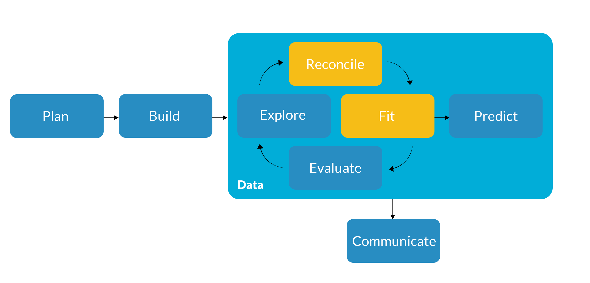
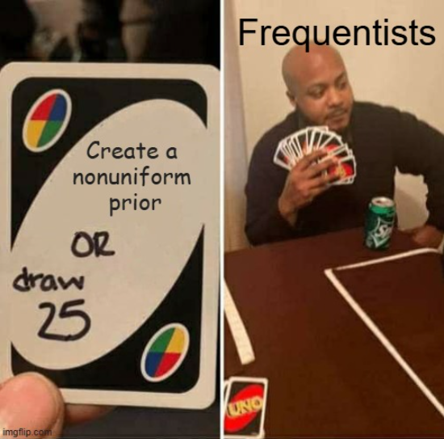
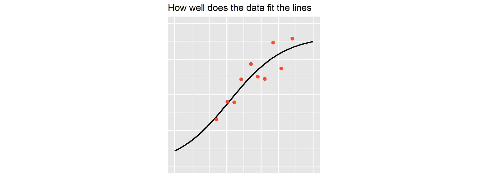
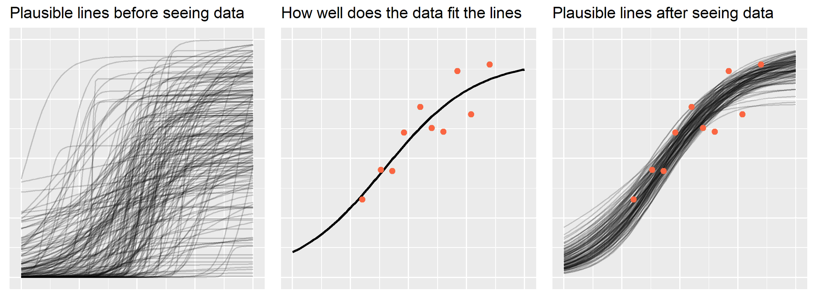

## {background-color="#288DC2"}

### Get Started {.permanent-marker-font}

#### Last Time

- Extended model fitting beyond ordinary least squares
- Continued comparing frequentist and Bayesian inference

#### Preview

- Use prior predictive checks to set priors
- Discuss using model selection to tune hyperparameters

## {background-color="#D1CBBD"}

::: {.columns .v-center}
{fig-align="center"}
:::

# Prior Predictive Checks

## Bayesian models

Both frequentist and Bayesian models use **likelihood functions**, so how does a Bayesian model differ?

:::: {.columns}

::: {.column width="60%"}
$$
y_i \sim \text{Binomial}(1, p_i) \\
\log\left({p_i \over 1 - p_i}\right) = \beta_0 + \beta_1 x_{1,i} + \cdots + \beta_p x_{p,i}
$$
:::

::: {.column width="40%"}
::: {.incremental}
- Parameters are **random variables**
- The **likelihood** $p(X, Y | \theta)$ is combined with a **prior** $p(\theta)$ to create a **posterior** $p(\theta | X, Y)$
- We sample draws from the posterior using **MCMC**
:::
:::

::::

## Bayesian models {visibility="uncounted"}

Both frequentist and Bayesian models use **likelihood functions**, so how does a Bayesian model differ?

:::: {.columns}

::: {.column width="60%"}
$$
y_i \sim \text{Binomial}(1, p_i) \\
\log\left({p_i \over 1 - p_i}\right) = \beta_0 + \beta_1 x_{1,i} + \cdots + \beta_p x_{p,i} \\
\beta \sim \text{Normal}(0, 10)
$$
:::

::: {.column width="40%"}
- Parameters are **random variables**
- The **likelihood** $p(X, Y | \theta)$ is combined with a **prior** $p(\theta)$ to create a **posterior** $p(\theta | X, Y)$
- We sample draws from the posterior using **MCMC**
:::

::::

::: {.fragment .fade-up .h-center}
### How do we specify priors?
:::

## Priors are part of the model

A prior distribution's parameters are known as **hyperparameters** and should be set to reflect what information we have about the parameters outside the data

::: {.fragment}
If we don't specify priors, most **probabilistic programming languages** (PPLs) will use default priors

```{python}
#| eval: true
#| echo: false

import os
import numpy as np
import polars as pl
import statsmodels.api as sm
import statsmodels.formula.api as smf
import bambi as bmb
import arviz as az
from sklearn.model_selection import train_test_split

# Set randomization seed
rng = np.random.default_rng(42)

# Specify a function to simulate data
def sim_data(n, beta_0, beta_price, beta_discount, beta_online, beta_promo, sigma):
    price = rng.normal(4, 2, size=n)
    discount = rng.normal(2, 1, size=n)
    online = rng.binomial(1, 0.7, size=n)
    promo = rng.binomial(1, 0.2, size=n)
    error = rng.normal(0, sigma, size=n)
    sales = beta_0 + beta_price * price + beta_discount * discount + beta_online * online + beta_promo * promo + error

    # Return the output
    return sales, price, discount, online, promo

# Call the function and convert to a dataframe
data_arr = sim_data(n = 100, beta_0 = 10, beta_price = -2, beta_discount = 3, beta_online = 5, beta_promo = 3, sigma = 5)
data_df = pl.DataFrame(data_arr, schema = ['sales', 'price', 'discount', 'online', 'promo']).to_pandas()
```

```{python}
#| eval: true
#| output-location: slide

# Specify predictors
predictors = [
  'price', 'discount', 'online', 'promo'
]

# Specify a Bayesian linear regression
ba_model = bmb.Model(
  'sales ~ ' + ' + '.join(predictors), 
  data = data_df
)

ba_model
```
:::

## 

::: {.v-center}
{fig-align="center"}
:::

## Start with a prior predictive distribution

What information could we have about the parameters outside of what's included in the data? [What is the minimum amount of data we need?]{.fragment}

::: {.fragment}
A **prior predictive distribution** (a.k.a., a prior predictive check) is the distribution of possible outcomes based on the likelihood and prior specifications alone

```{python}
#| eval: true
#| output-location: slide
#| code-line-numbers: "|1-6|8|10-13|11|12|13"

# Specify priors
priors_dict = {
  'Intercept': bmb.Prior('Normal', mu = 0, sigma = 10),
  **{term: bmb.Prior('Normal', mu = 0, sigma = 10) for term in predictors},
  'sigma': bmb.Prior("Exponential", lam=1)
}

ba_model.set_priors(priors = priors_dict)

# Prior predictive sampling
ba_model.build()
ba_ppc = ba_model.prior_predictive()
az.plot_ppc(ba_ppc, group = 'prior')
```
:::

## Prior and posterior predictive distributions

The "updated" version of the prior predictive distribution is the **posterior predictive distribution**, which incorporates information from the data as well

::: {.fragment}
We can use the prior predictive distribution to check if our model is **reasonable** before estimation and the posterior predictive distribution to check if our model is **missing something** after estimation

```{python}
#| eval: true
#| echo: false

# Collapse industries into aggregate categories
industry_names = {
    # Business
    'Business': 'Business',
    'Retail': 'Business',
    'CPG': 'Business',
    'Luxury': 'Business',
    'eCommerce': 'Business',
    'Airlines': 'Business',

    # Tech
    'Tech': 'Tech',
    'Media': 'Tech',

    # ProfessionalServices
    'Professional Services': 'ProfessionalServices',
    'Finance': 'ProfessionalServices',
    'Marketing': 'ProfessionalServices',
    'Consulting': 'ProfessionalServices',

    # HealthcareEducation
    'Medical': 'HealthcareEducation',
    'Education': 'HealthcareEducation',

    # Public
    'Government & Non-Profits': 'Public',
    'Utilities': 'Public',
    'Construction & Manufacturing': 'Public'
}

leads_train = (pl.read_parquet(os.path.join('data', 'leads.parquet'))
    # Collapse Industry into a smaller number of categories
    .with_columns(
        pl.col('Industry')
        .replace(industry_names)
        .alias('Industry')
    )
    # Drop rows with 'Other' and 'Unknown' values
    .remove(
        (pl.col('Industry') == 'Other') | (pl.col('TimeZone') == 'Unknown') |
        (pl.col('Employees') == 'Unknown')
    )
    # Make the outcome binary where 'Qualified' = 1
    .with_columns(
        pl.when(pl.col('Stage') == 'Qualified').then(1)
        .when(pl.col('Stage') == 'Disqualified').then(0)
        .alias('Qualified')
    )
    # Clean up activity type variable names
    .rename({
        'ActivityTypePhone Call': 'ActivityTypePhoneCall',
        'ActivityTypeEmail Response': 'ActivityTypeEmailResponse',
        'ActivityTypeLead Handraise': 'ActivityTypeLeadHandraise',
        'ActivityTypeWeb Schedule': 'ActivityTypeWebSchedule'
    })
    # Exclude Amount
    .select(pl.exclude('Amount'))
    # Log-transform days_elapsed
    .with_columns(
        (pl.col('days_elapsed') + 1).log().alias('log_days_elapsed')
    )
    # Dummy code discrete predictors
    .to_dummies(
        columns = ['Industry', 'Employees', 'TimeZone', 'LeadSource', 'EmployeeId'], 
        drop_first = False
    )
    # Drop Stage and days_elapsed along with reference levels
    .select(pl.exclude(
        'Stage', 'days_elapsed', 'Industry_Business', 'Employees_Small', 
        'TimeZone_EST', 'LeadSource_Purchased List', 'EmployeeId_1'
    ))
    # Clean up lead source variable names
    .rename({
        'LeadSource_Trade Shows and Events': 'LeadSource_TradeShowsandEvents',
        'LeadSource_Web Registration': 'LeadSource_WebRegistration'
    })
    # Convert to pandas
    .to_pandas()
)
```

```{python}
#| eval: true
#| output-location: slide

# Specify predictors
predictors = [
  'Industry_HealthcareEducation', 'Industry_ProfessionalServices',
  'Industry_Public', 'Industry_Tech', 'Employees_Large', 'Employees_Medium',
  'TimeZone_CST', 'TimeZone_MST', 'TimeZone_PST',
  'LeadSource_TradeShowsandEvents', 'LeadSource_WebRegistration',
  'log_days_elapsed', 'created_quarter', 'contact_quarter', 'latest_quarter',
  'EmployeeId_2', 'EmployeeId_3', 'EmployeeId_4', 'EmployeeId_5',
  'ActivityTypeEmail', 'ActivityTypePhoneCall', 'ActivityTypeEmailResponse',
  'ActivityTypeMeeting', 'ActivityTypeLeadHandraise', 'ActivityTypeWebSchedule'
]

# Specify a Bayesian logistic regression
ba_model = bmb.Model(
  'Qualified ~ ' + ' + '.join(predictors), 
  data = leads_train,
  family = 'bernoulli'
)

ba_model
```
:::

## Propagating uncertainty into our predictions

How will the uncertainty we have about our parameters be reflected in the prior vs. posterior predictive distributions?

```{python}
#| eval: true
#| output-location: slide

# Specify priors
priors_dict = {
  'Intercept': bmb.Prior('Normal', mu = 0, sigma = 10),
  **{term: bmb.Prior('Normal', mu = 0, sigma = 10) for term in predictors}
}

ba_model.set_priors(priors = priors_dict)

# Prior predictive sampling
ba_model.build()
ba_ppc = ba_model.prior_predictive()
az.plot_ppc(ba_ppc, group = 'prior')
```

## 

:::: {.columns .v-center}

::: {.column width="100%"}
{fig-align="center"}
:::

::::

## 

:::: {.columns .v-center}

::: {.column width="100%"}
{fig-align="center"}
:::

::::

# Try specifying different priors. How does the prior predictive distribution change? {background-color="#006242"}

# Hyperparameter Tuning

## Dealing with hyperparameters

In general, **hyperparameters** are parameters that are not directly estimated when we fit the model

::: {.fragment}
What "hyperparameters" have we already seen?

::: {.incremental}
- Prior distribution hyperparameters (e.g., $\mu$ and $\sigma^2$ for a normal prior)
- Deciding on what predictors to include in the model, including **interactions**
- Feature engineering decisions (e.g., whether or not to **standardize/normalize**)
- Choosing between different likelihood and link functions
:::
:::

::: {.fragment}
Predictive models often have **many** hyperparameters, so how do we set them?
:::

## Overall model fit and hyperparameter tuning

We can use **overall model fit** to compare models with different hyperparameters and choose the one that predicts best, a process known as **hyperparameter tuning**

```{python}
#| eval: false

# Specify a second set of predictors (without activity types)
predictors_02 = [
  'Industry_HealthcareEducation', 'Industry_ProfessionalServices',
  'Industry_Public', 'Industry_Tech', 'Employees_Large', 'Employees_Medium',
  'TimeZone_CST', 'TimeZone_MST', 'TimeZone_PST',
  'LeadSource_TradeShowsandEvents', 'LeadSource_WebRegistration',
  'log_days_elapsed', 'created_quarter', 'contact_quarter', 'latest_quarter',
  'EmployeeId_2', 'EmployeeId_3', 'EmployeeId_4', 'EmployeeId_5'
]

# Fit two frequentist logistic regressions
fr_fit_01 = smf.glm(
    'Qualified ~ ' + ' + '.join(predictors), 
    data = leads_train, 
    family = sm.families.Binomial()
).fit()

fr_fit_02 = smf.glm(
    'Qualified ~ ' + ' + '.join(predictors_02), 
    data = leads_train, 
    family = sm.families.Binomial()
).fit()
```

# Compare these two models using overall model fit. Which one predicts best? {background-color="#006242"}

# Accuracy

## Discrete outcomes and overall model fit

::: {.incremental}
- What measure of overall model fit is appropriate when you have a discrete outcome?
- Do we want to rely on in-sample, predictive, or decision-theoretic fit?
- What could go wrong with using the test data to tune hyperparameters?
:::

## {background-color="#006242"}

### Exercise 16 {.lato-font}

1. Review the advanced materials from the course thus far
2. Identify lingering questions you have about the concepts covered
3. Use an AI tool to ask your questions and reflect on the responses you receive
4. Identify at least two questions you feel have been answered and share your prompts, the responses you received, and your reflections on the responses
5. Submit your prompts, responses, and reflections as a single PDF on Canvas

## {background-color="#288DC2"}

### Wrap Up {.permanent-marker-font}

#### Summary

- Used prior predictive checks to set priors
- Discussed using model selection to tune hyperparameters

#### Next Time

- Discuss additional measures of overall classification model fit
- Introduce cross-validation for model selection and hyperparameter tuning

